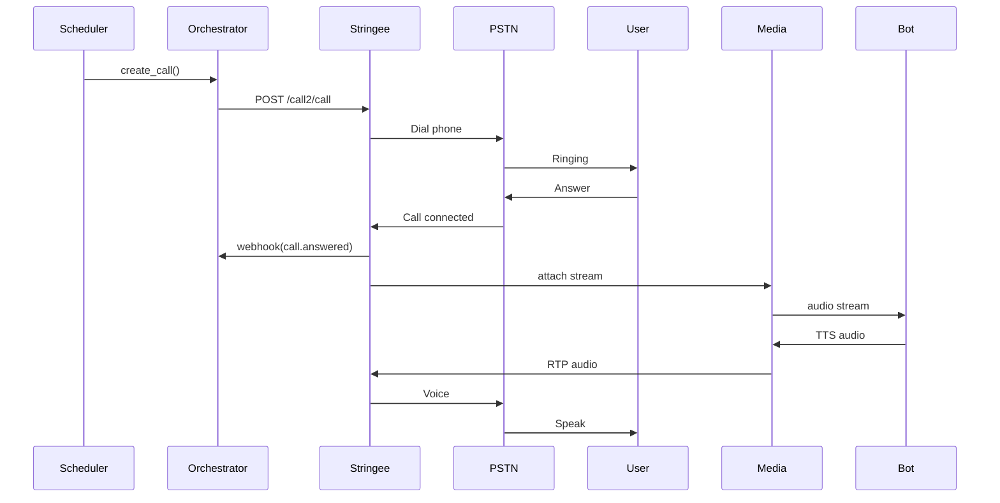
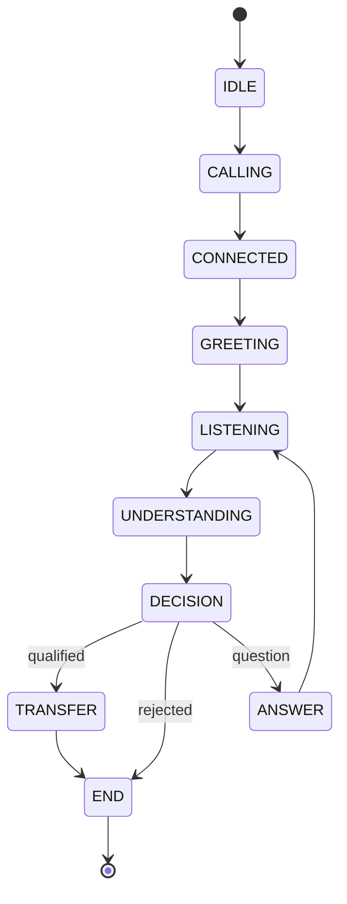
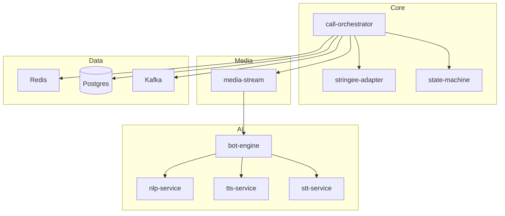
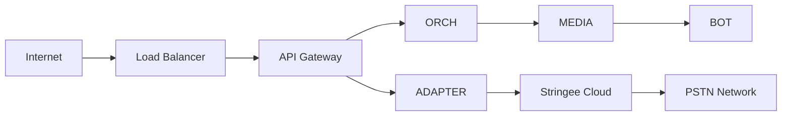
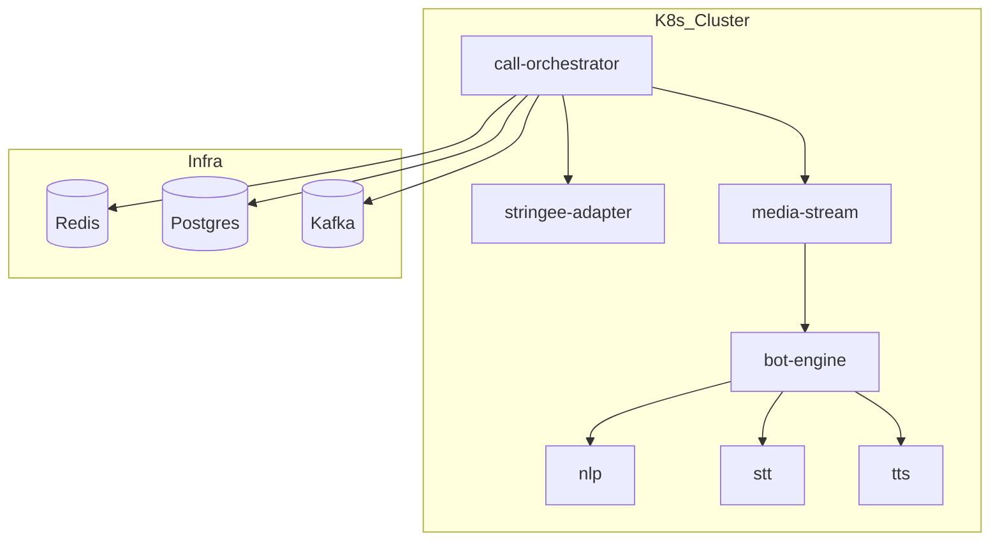
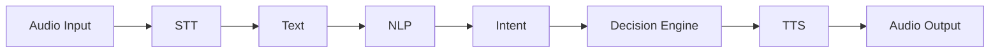
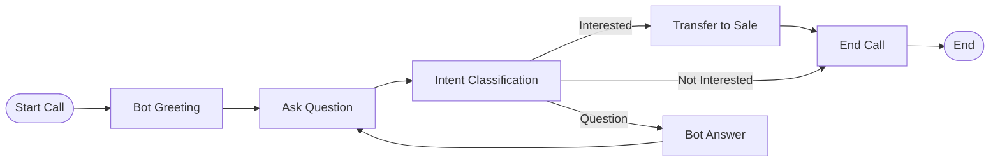
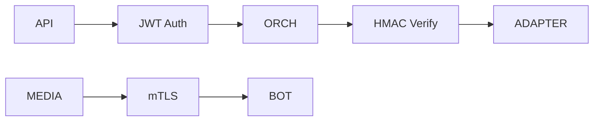

# Mermaid Architecture Pack

## AI Callbot – Bot → Phone (Stringee Integration)

> Full technical architecture documentation using Mermaid diagrams
> Use in GitHub, GitLab, Notion, MkDocs, Docusaurus, Obsidian

---

# 1. System Architecture

```mermaid
flowchart LR
    CRM[CRM / ERP / Database]
    USER[Phone User ☎]

    ORCH[Call Orchestrator<br/>(Workflow + State Machine)]
    ADAPTER[Stringee Adapter<br/>(Call API + Webhook)]
    STRINGEE[Stringee Platform]
    PSTN[PSTN Gateway]

    MEDIA[Media Stream Service<br/>(RTP/WebRTC Bridge)]
    BOT[AI Bot Engine<br/>(STT / TTS / NLP / LLM)]

    CRM --> ORCH
    ORCH --> ADAPTER
    ADAPTER --> STRINGEE
    STRINGEE --> PSTN
    PSTN --> USER

    USER --> PSTN
    PSTN --> STRINGEE
    STRINGEE --> ADAPTER
    ADAPTER --> ORCH

    STRINGEE <--> MEDIA
    MEDIA <--> BOT
```

---

# 2. Call Flow Sequence



---

# 3. Bot State Machine



---

# 4. Media Flow

```mermaid
flowchart LR
    MIC[Phone Mic] --> PSTN
    PSTN --> STRINGEE[Stringee]
    STRINGEE --> MEDIA[Media Stream Service]
    MEDIA --> BOT[AI Bot Engine (STT)]

    BOT --> MEDIA
    MEDIA --> STRINGEE
    STRINGEE --> PSTN
    PSTN --> SPK[Phone Speaker]
```

---

# 5. Microservice Map



---

# 6. Network Topology



---

# 7. Deployment (Kubernetes)



---

# 8. Data Flow



---

# 9. Business Flow



---

# 10. Security Flow



---

# END OF ARCHITECTURE PACK
